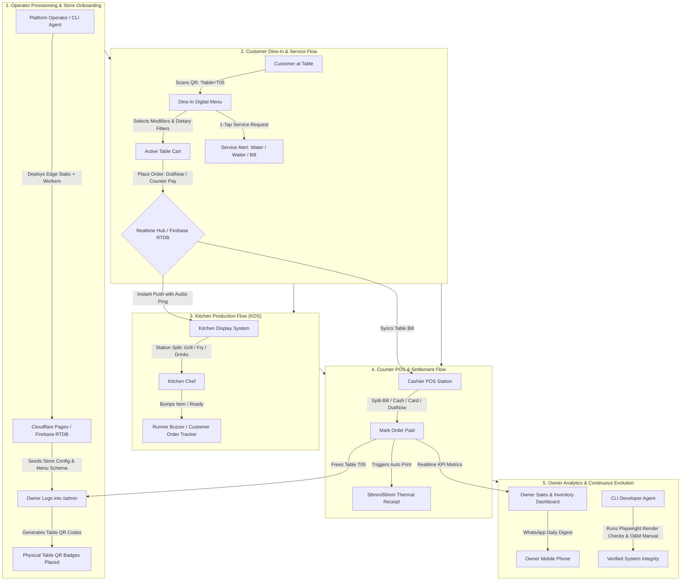

# Architecture Proposal & Implementation Blueprint: Full-Stack ARH Premium F&B Webapp

> **Date**: 2026-08-17  
> **Target System**: ARH FNB Suite (Dine-In, Kitchen KDS, Counter POS, Owner Ops & Showroom)  
> **Governing Skill**: `.claude/skills/flow-of-events-first/SKILL.md`  
> **Reference Implementations Evaluated**:
> - `https://github.com/MukundaKatta/amogha-cafe.git`
> - `https://github.com/Asim12312/ChefOS.git`
> - `DPIK Tugas Laravel` (`master-flow-of-events.md`)

---

## 1. Executive Summary & Core Stance

Per the **Flow of Events First** methodology established in this repository:
```text
flow of events --> required actions --> workflow --> implementation --> verification
(ground truth,     (what must be       (designed     (code that          (rehearse SAME
 per entrypoint,     made possible,      to cater to   realizes the        flow against
 real world)         derived)            the actions)  workflow)           rendered pixels)
```

The objective is to expand the **ARH FNB Webapp** from a luxury digital menu & basic admin shell into a **commercial-grade, full-stack F&B operating suite** spanning:
1. **Customer Dine-In Surface**: QR table auto-binding, allergen filters, table cart, 1-tap service requests, live order tracking, split-bill calculator.
2. **Kitchen Display System (KDS)**: Real-time ticket aging alerts (color coded), Web Audio chimes, station routing (Grill / Fry / Bar / Expo), bump bar.
3. **High-Speed Counter POS**: Touch-optimized category rail & modifier modal, multi-tender settlement (Cash, DuitNow QR, Card), split payments, 58mm/80mm ESC/POS thermal printing.
4. **Store Owner & Operations Console**: Floor plan & Table QR generator, 86/out-of-stock live toggles, inventory low-stock warnings, PIN-governed staff roles, AI menu insights.
5. **Interactive Tier Showroom**: Multi-surface switcher allowing operators and prospective buyers to experience Customer, KDS, POS, and Admin views side-by-side.

---

## 2. Actor Directory & Authority Matrix

| Actor | Real-World Duty / Physical Reality | System Authority & Surface | Core Boundary / Guardrail |
| :--- | :--- | :--- | :--- |
| **Customer** | Arrives at table, scans QR, configures modifiers/diet, requests waiter/bill, pays, tracks meal prep, writes feedback. | **Customer PWA / Dine-In Surface** (`/`, `?table=Txx`)<br>• Tokenized Table Session<br>• Cart, Service Call, Split-Bill, Tracker | • Cannot modify pricing or order state once submitted.<br>• Session tied strictly to active table until settled. |
| **Store Owner & Staff** *(Cashier, Kitchen, Runner, Manager)* | Cashier taps orders & settles tenders; Kitchen cooks & bumps tickets; Runner serves; Owner 86es items, checks revenue & staff shifts. | **Operations & POS / KDS Surfaces** (`/pos`, `/kds`, `/admin`)<br>• Role-Based PIN Access (`cashier`, `chef`, `manager`, `owner`)<br>• KDS Station Routing & Order Bumping | • Cashiers cannot void closed bills without Manager PIN.<br>• Kitchen only mutates order prep stages (`preparing`, `ready`). |
| **Platform Developer Operator** | Provisions cloud/edge infra, rotates WhatsApp relay tokens, configures DuitNow/Stripe webhooks, monitors database health & tier licensing. | **Infrastructure Plane** (`/tools`, `wa-relay`, Cloudflare Workers, Firebase RTDB)<br>• Automated Edge Deployments<br>• Access Gate & Tier Feature Locks | • Zero runtime DB schema mutations on client devices.<br>• Graceful degradation if external payment/WhatsApp API drops. |
| **CLI Agents Developer** | Fast cold-start discovery, headless Playwright regression testing against rendered pixels, schema validation, O&M compliance. | **Agent Development Plane** (`.omk`, `tests/`, `.om-manual`, `verify-tier-contract.py`)<br>• Headless DOM inspection<br>• Strict JSON Schemas | • Must verify against rendered screenshot/DOM, not mock state.<br>• Strict adherence to zero-build Vanilla/ESM constraints. |

---

## 3. End-to-End Master Lifecycle Flow



---

## 4. Module Absorption & Comparison Matrix

```
┌────────────────────────────────────────────────────────────────────────────────────────┐
│                        ABSORPTION MATRIX FOR ARH PREMIUM FNB                          │
├──────────────────────────────────────┬─────────────────────────────────────────────────┤
│ Module                               │ Source & Purpose                                │
├──────────────────────────────────────┼─────────────────────────────────────────────────┤
│ 1. Web Audio KDS Chime Engine        │ amogha-cafe/kitchen (Custom synthesized bell    │
│                                      │ sounds without external audio file latency)     │
│ 2. Realtime Service Request Hub      │ ChefOS/ServiceRequests.jsx (Waiter call alert   │
│                                      │ ribbon across POS & KDS topbars)                │
│ 3. Table Floor Matrix & QR Exporter  │ ChefOS/TableManagement.jsx (Visual SVG table    │
│                                      │ layout with 1-click batch printable QR sheets)  │
│ 4. Dietary & Allergen Badge Matrix   │ amogha-cafe/src/js/diet.js & badges.js          │
│                                      │ (Halal, Keto, Nut-Free, Calorie chips)          │
│ 5. Thermal ESC/POS Receipt Formatter │ amogha-cafe/pos (Raw browser canvas/text thermal│
│                                      │ print formatting for 58mm/80mm receipt printers)│
│ 6. Multi-Surface Showroom Switcher   │ arh-fnb-tier-showroom (Seamless iframe ribbon   │
│                                      │ switching between Dine-In, POS, KDS, and Admin) │
└──────────────────────────────────────┴─────────────────────────────────────────────────┘
```

---

## 5. Structured Build Steps to Completion

### Phase 1: Core Foundation & Shared Realtime Adapter
- [ ] Implement `shared/realtime-adapter.js` supporting dual-mode: Realtime Firebase RTDB and offline LocalStorage fallback.
- [ ] Standardize Order & Table State Schema:
  ```json
  {
    "order_id": "ORD-20260817-001",
    "table_id": "T05",
    "status": "pending | preparing | ready | served | paid",
    "station": "all | grill | fry | bar | expo",
    "items": [...],
    "service_requests": [...],
    "created_at": "2026-08-17T01:00:00Z"
  }
  ```

### Phase 2: Kitchen Display System (KDS Surface)
- [ ] Create `kds/index.html`, `kds/kds.js`, and `kds/kds.css` adopting Amogha's visual aging algorithm:
  - Green badge: `< 10 mins`
  - Yellow badge: `10 - 20 mins`
  - Pulsing Red alert: `> 20 mins`
- [ ] Synthesize Web Audio chime generator on incoming tickets.
- [ ] Implement station filtering (`Grill`, `Fry`, `Bar`, `Expo`) and item/ticket bump transitions.

### Phase 3: High-Speed Counter POS Surface
- [ ] Create `pos/index.html`, `pos/pos.js`, and `pos/pos.css` adopting Amogha's category rail + touch grid.
- [ ] Implement Table Management & Floor Plan view with live status (`Vacant`, `Occupied`, `Bill Requested`).
- [ ] Add Multi-Tender & Split Bill calculator (Cash change, DuitNow QR, Card).
- [ ] Integrate 58mm/80mm ESC/POS thermal receipt formatting and browser print trigger.

### Phase 4: Customer Dine-In & Service Requests
- [ ] Upgrade `premium/index.html` and `premium/app.js` with table QR auto-binding (`?table=T05`).
- [ ] Embed 1-tap Service Request Action Sheet (*"Call Waiter"*, *"Water/Glasses"*, *"Cutlery"*, *"Request Bill"*).
- [ ] Integrate allergen & dietary badge filtering (*Halal*, *Keto*, *Nut-Free*, *Vegetarian*).
- [ ] Add live order tracking HUD showing prep status with stage indicators.

### Phase 5: Owner Hub & Showroom Integration
- [ ] Add Table & QR Code batch exporter to `admin/admin.html`.
- [ ] Integrate 86/Sold-out instant menu toggles.
- [ ] Update `showroom/index.html` multi-surface selector to switch between **Customer Menu**, **POS Station**, **Kitchen KDS**, and **Owner Console**.

### Phase 6: Flow-of-Events Verification & O&M Sign-Off
- [ ] Write Playwright end-to-end visual tests verifying rendered pixels:
  - Customer places order $\rightarrow$ KDS receives ticket & plays chime $\rightarrow$ POS settles payment $\rightarrow$ Table is freed.
- [ ] Generate O&M manual report using `arh-om-manual`.
